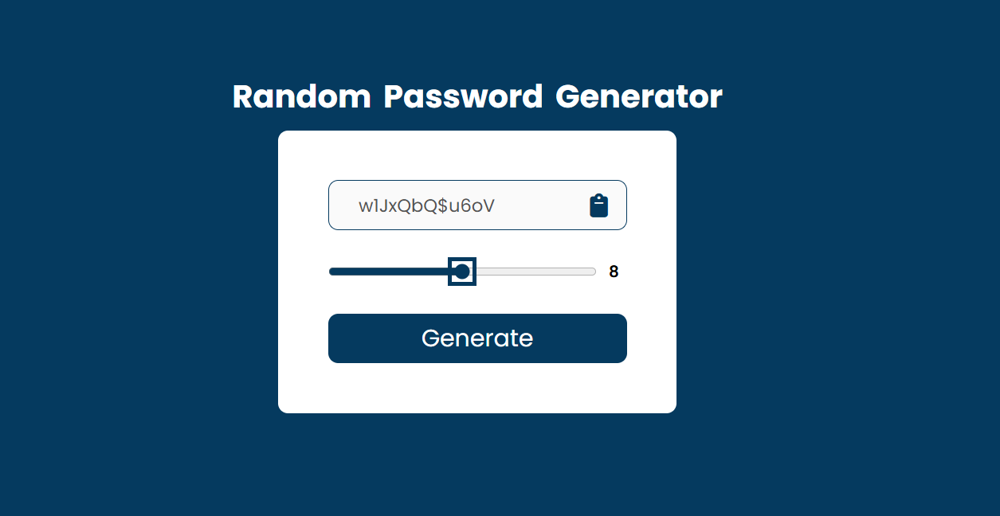

# Random Password Generator

A simple and user-friendly random password generator built with HTML, CSS, and JavaScript. It allows users to generate strong, secure passwords of customizable lengths and copy them to the clipboard with a single click.

## Features
- Generates random passwords using a mix of letters, numbers, and symbols.
- Customizable password length (between 8 and 16 characters).
- One-click copy functionality using the clipboard API.
- Intuitive slider to adjust password length.
- Clean and responsive design using CSS Flexbox.

## Technologies Used
- HTML5
- CSS3
- JavaScript (ES6+)
- Font Awesome for icons

## How to Use
1. Clone the repository:
    ```bash
    git clone https://github.com/your-username/Random-Password-Generator.git
    ```
2. Open the `index.html` file in your browser to use the password generator.
3. Use the slider to adjust the password length.
4. Click the "Generate" button to create a password.
5. Click the clipboard icon to copy the password to your clipboard.

## Getting Started Locally
1. Clone the repository:
    ```bash
    git clone https://github.com/your-username/Random-Password-Generator.git
    ```
2. Navigate to the project directory:
    ```bash
    cd Random-Password-Generator
    ```
3. Open `index.html` in your preferred web browser.

## Screenshots

